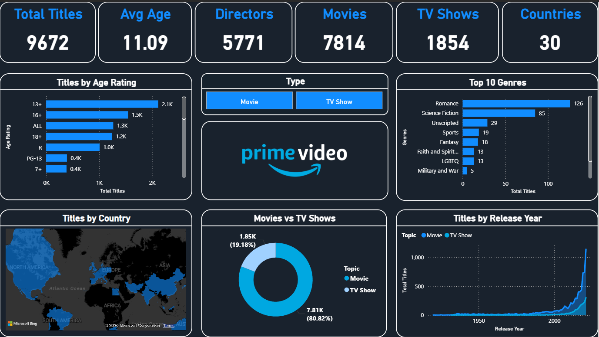

# 📊 Amazon Prime Video Dashboard (Power BI)

This is an interactive Power BI dashboard built on the Amazon Prime Video dataset. It explores content distribution by type, age rating, genre, country, and release year.

## 🔍 Key Insights
- Total titles on the platform  
- Movies vs TV Shows  
- Average age rating  
- Top 10 genres  
- Titles by country  
- Titles by release year  

## 🛠 Tools Used
- Power BI Desktop  
- Power Query  
- DAX

## 🚀 How to Use
1. Download the `.pbix` file  
2. Open in Power BI Desktop  
3. Explore using slicers and charts

> Note: Ratings represent **age certifications** (7+, 13+, 18+), not IMDb scores.
